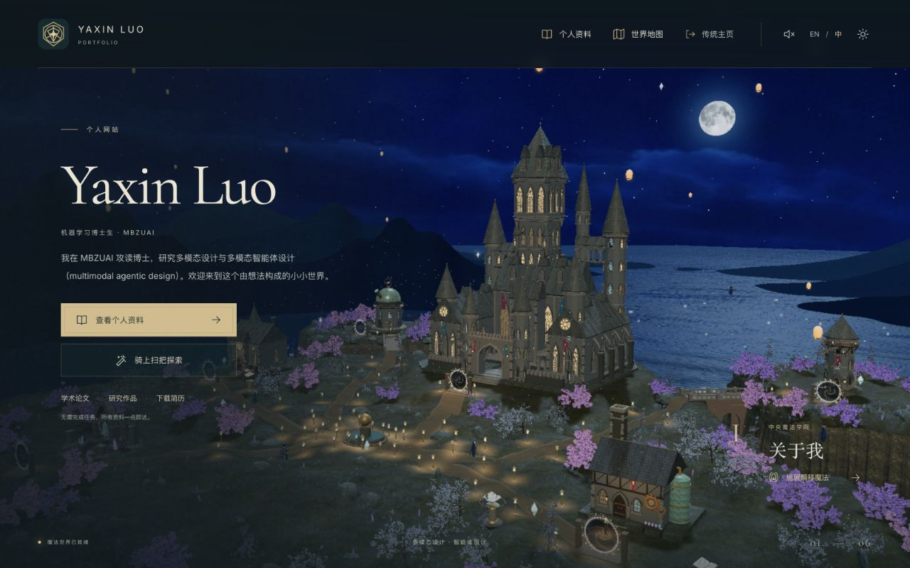
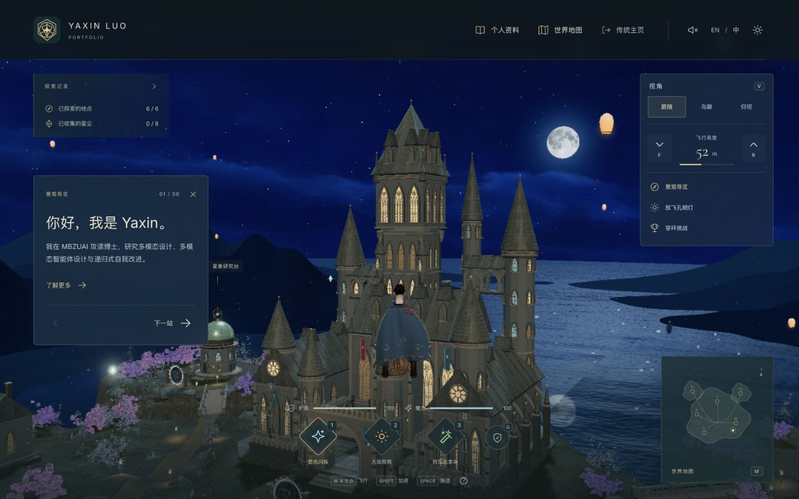
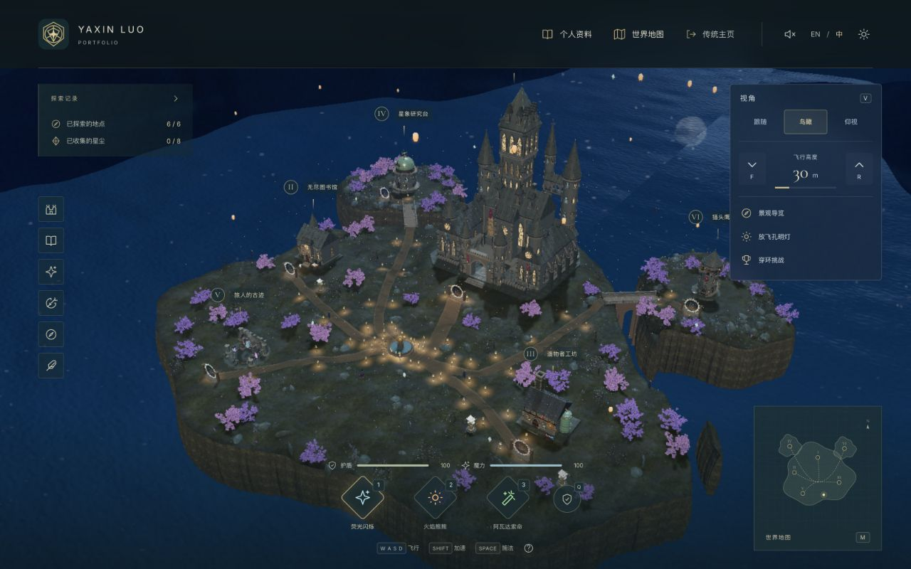
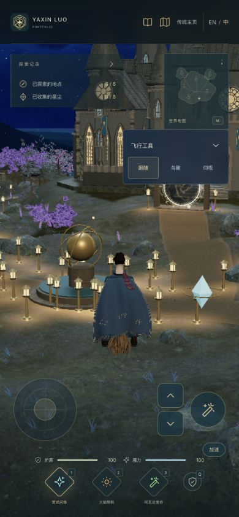

# Moonlit world iteration — 8 September 2026

The requested direction is a bright, expansive magical night that carries a personal portfolio. The welcome title remains **Yaxin Luo / Personal website**. Reading research, projects, experience and contact information never requires gameplay.

## Asset-first work

- The academy now measures **58 × 73.8 × 48.55 m**, with a courtyard, long wings, roofed sky galleries, a belfry, dormers, carved arches and layered towers. Standalone Blender renders were revised before integration. The source and GLB are downloadable in Asset Studio.
- The rider has an adapted CC0 anatomical head and textured hair, a continuous fitted coat, lined embroidered cape and detailed broom. The guardian has an ivory mask, crescent crown, layered dark-blue drapery and a luminous core. Source authors and licenses are recorded separately from original geometry.
- Trees were reduced from a cap of 215 to 112, with lilac, cherry and silver foliage opening up sightlines. Two generated textures are actually used for the sky and flower cards. The moon uses a credited NASA lunar map.
- Paper lanterns, garden lamps, genuine arched viaducts and curved floating books have individual Asset Studio entries. Book lettering follows the curved page surface; visible exhibits open AutoDesign, DViN or APL.

## Runtime screenshot → review → refinement

These passes were performed on the live WebGL build, in addition to individual asset renders:

1. **First assembly:** enlarged grounds and castle exposed an overcast blue sky, cold paths and a visually flat background wall. Review identified bridge decks buried in the old island surface and uneven book pedestals.
2. **Composition and terrain:** the welcome camera was brought closer; waterways were cut through the land beneath both arched bridges, and exhibit platforms were graded. Camera and rider collision were updated to the actual castle and bridge geometry.
3. **Night color:** a second sky texture replaced the bright cloud cover with open cobalt space and thin low clouds. The lunar material and orientation were corrected so that the NASA maria remain visible. Amber pools were added along paths; purple and silver trees provide distinct color families.
4. **Depth and silhouettes:** the distant gray wall became three irregular dark-blue ridges with open valleys. Dense distant tree instances were removed. This also reduced distant terrain/forest rendering work. The whole castle and rider were reviewed again in the browser, and the tour target was raised to retain its highest tower.
5. **Interaction and small-screen refinement:** actual 390 × 844 screenshots prompted a collapsible Flight tools panel and a longer portrait tour camera boom. A subsequent challenge screenshot exposed a timer/tool overlap, which was corrected. Book language switching, camera selection during a tour, click-to-fly tour exit, native Space activation and flying through real bridge arches received targeted fixes.

The image-generation refinement target was created from an actual iteration-2 screenshot and the user's moonlit castle reference using the built-in ImageGen route. Its brief asked for the same layout and architecture, open cobalt night, restrained thin clouds, a readable moon, warm path light, purple foliage and layered depth. It is an **art-direction target**, not a screenshot, background replacement or evidence of achieved visual quality. The delivered scene continues to use real Three.js geometry. Full sky and botanical prompts are preserved in [night-garden-art.md](night-garden-art.md); the character prompt is in [world-character-assets.md](world-character-assets.md).

## Final screenshots

The following are actual browser captures, not generated images:

Additional intermediate screenshots, the distinctly labeled generated target, original Blender character renders and a machine-readable asset audit are retained in the local delivery's `qa/` directory.

## Practical limits

This revision substantially changes the assets, scale, lighting and interaction. It remains a stylized browser environment, with repeated materials, procedural rock formations, a posed character and lightweight cape motion. It does **not** establish AAA production quality, cinematic skin/hair, cloth simulation or a full animation set. Browser viewport checks are not physical-phone GPU or simultaneous multi-touch proof. See the exact checks and remaining coverage in [world-verification.md](world-verification.md).
